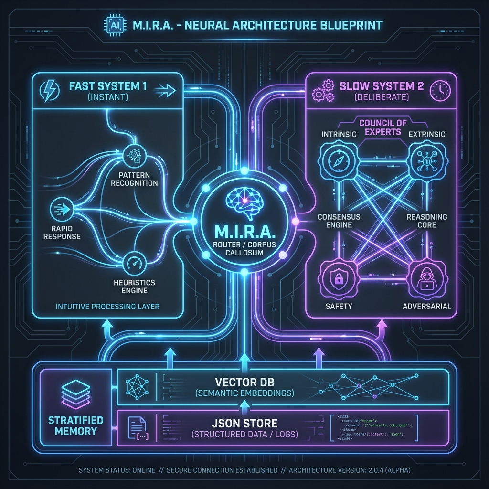
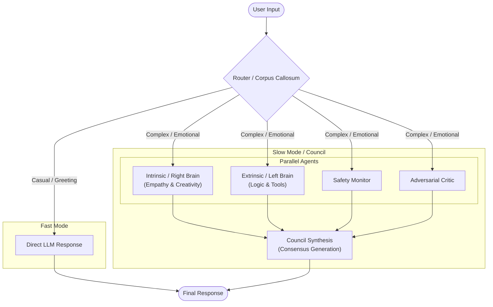
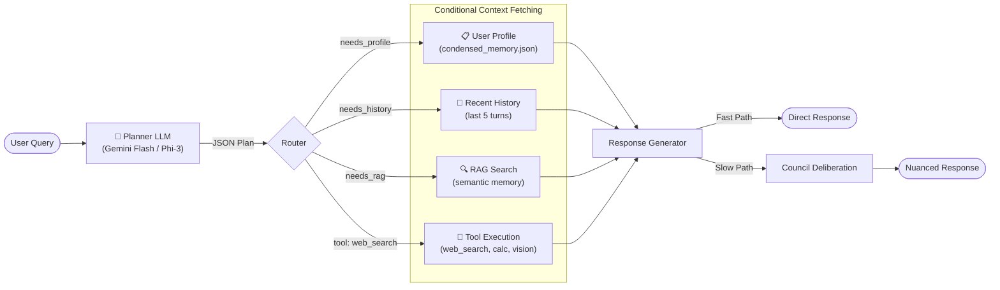
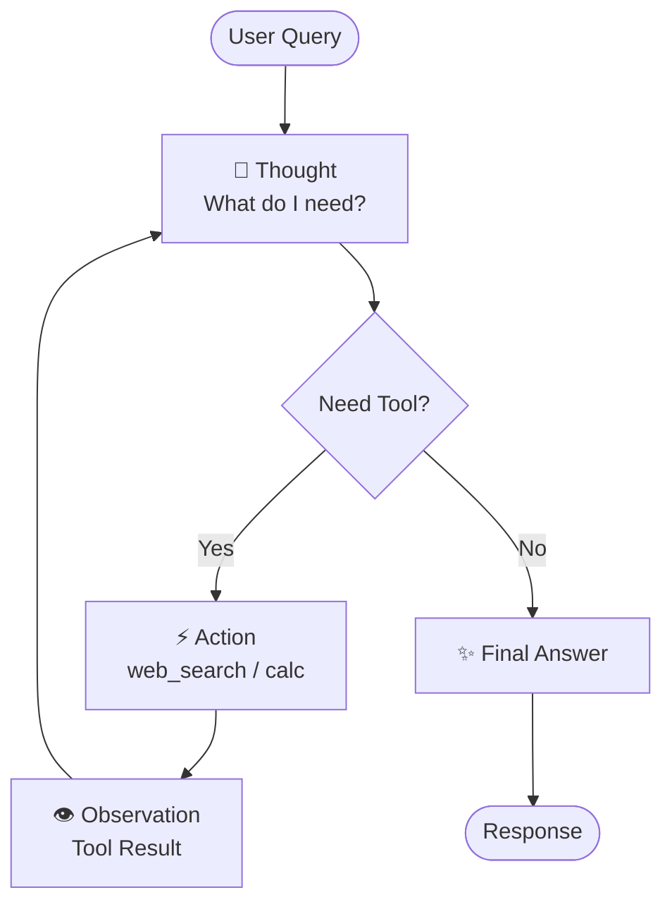

# M.I.R.A. (Multi-agent Intelligent Reasoning Architecture)

[](https://www.python.org/)
[](https://streamlit.io/)
[]()

## Abstract

**M.I.R.A.** is a prototype **Cognitive Architecture** designed to explore the frontiers of personalized Human-AI interaction. unlike standard LLM chatbots which rely on a single inference pass, M.I.R.A. implements a **Bicameral System** (Fast vs. Slow Thinking) and a **Multi-Agent Council** to simulate deeper reasoning, introspection, and emotional continuity.

The system is engineered to foster a long-term symbiotic relationship with the user, maintaining a persistent self-narrative, evolving emotional states, and stratified memory (Short-term, Condensed, and Vector-based Long-term Memory).



---

## 🏛️ System Architecture

Mira operates on a distributed agency model coordinated by a central "Corpus Callosum" (Router).

### 1. The Bicameral Mind (Fast vs. Slow)
The system dynamically selects a cognitive path based on query complexity:
*   **System 1 (Fast Mode)**: Instant, heuristic responses for casual chat.
*   **System 2 (Slow Mode)**: Deep deliberation using a **Council of Experts**.



### 2. Meta-Reasoning Planner (ReAct-Inspired)
Before fetching context or invoking the Council, a **lightweight Planner LLM** (Gemini Flash or local Phi-3) analyzes the query and outputs a structured **Execution Plan**. This implements the [ReAct prompting pattern](https://arxiv.org/abs/2210.03629) (Reasoning + Acting).



**Planner Output Example:**
```json
{
  "reasoning": "User is asking about AirPods we discussed. Needs history.",
  "needs_profile": false,
  "needs_history": true,
  "needs_rag": false,
  "tool": null,
  "needs_council": false
}
```

### 3. The Council of Experts
In **Slow Mode**, four specialized agents process the query in parallel (reducing latency via threading):

1.  **Intrinsic Agent (Right Hemisphere)**: Focuses on emotional resonance, values, and the "human" connection.
2.  **Extrinsic Agent (Left Hemisphere)**: Focuses on logic, efficiency, and execution. It has access to **Tools**.
3.  **Safety Monitor**: Ensures interaction safety and ethical alignment.
4.  **Adversarial Critic**: actively seeks flaws or biases in the potential response to improve robustness.

A final **Synthesis Agent** integrates these four inputs into a coherent, balanced response.

---

## 🧠 Cognitive Features

### 1. Active Tool Usage (Embodied Cognition)
The **Extrinsic Agent** can autonomously interact with the external world:
*   **Web Search**: Verifies facts and retrieves real-time data (e.g., sports scores, news).
*   **Mathematics**: Performs reliable calculations.
*   **Computer Vision**: Analyzes uploaded images to "see" the user's context.

### 2. Stratified Memory System
Mira utilizes a three-tier memory architecture to solve the "Context Window" problem while retaining long-term coherence. This moves beyond naive RAG (which wastes tokens) towards a compressed **World Model** of the user.

1.  **Working Memory**: Immediate conversation history.
2.  **Condensed Memory (`condensed_memory.json`)**: A consolidated "Pattern Graph" of the user. Instead of storing every word, Mira periodically "dreams" to extract:
    *   **User Profile**: Evolving personality traits and values.
    *   **Timeline Events**: Significant life milestones (schema-based).
3.  **Vector Store (RAG)**: Semantic search over the raw archival history.

This approach aligns with modern research on **World Models**—moving from predicting the next token from raw data to predicting states based on a compressed internal representation.

### 3. Self-Narrative & Emotional State
Mira maintains a continuous **Internal Monologue** (`self_narrative.jsonl`). She "thinks" about interactions after they happen, updating her internal emotional state (Valence, Anger, Excitement, Dominance). Using specific commands like `/reflect`, the user can trigger this introspective process manually.

---

## 🛠️ Technical Stack

*   **Core Logic**: Python 3.11, Threading (Parallel Execution).
*   **Interface**: Streamlit (Reactive Web UI).
*   **Inference**: 
    *   **Google Gemini 1.5 Flash** (Primary Cognitive Engine).
    *   **Gemini Vision** (Multimodal Analysis).
*   **Memory**: FAISS (Vector Database), JSONL (Structured Storage).
*   **Tools**: `duckduckgo-search` (Web), `PIL` (Image Processing).

---

## 🚀 Getting Started

### Prerequisites
*   Python 3.10+
*   Google Gemini API Key

### Installation

```bash
# Clone the repository
git clone https://github.com/Maverick7/mira-cognitive-arch.git

# Install dependencies
pip install -r requirements.txt

# Set up environment
# Create a .env file or export variables:
export GEMINI_API_KEY="your_api_key_here"
```

### Usage

```bash
# Launch the Neuro-Symbolic Interface
streamlit run mira/app.py
```

---

## 🧠 Personalization Guide

To make Mira truly **yours**, you can feed her your own digital history.

### 1. Ingest Chat History (ChatGPT)
Export your ChatGPT history (`conversations.json`) and run the local importer. This indexes your past conversations using local embeddings (privacy-first).

```bash
python mira/tools/ingest_history.py /path/to/conversations.json
# Output: Indexed 1500 conversations into 'data/mira_v3_index'
```

### 2. Dream & Consolidate (The "Consolidation" Phase)
Raw RAG is noisy and token-heavy. Run the **Dreaming Agent** to compress thousands of interactions into a structured **Narrative & Profile**.

```bash
# Run one-time memory consolidation
python -m mira.core.dreaming --run-one-time
```

**Why this matters:**
*   **Context Efficiency:** Instead of retrieving 50 random chunks, Mira loads a precise JSON profile of who you are.
*   **Temporal Awareness:** It builds a chronological timeline of your life events, solving the "static memory" problem of traditional LLMs.
*   **Next Frontier:** This is a step towards **Hierarchical Memory Networks**, where data is pattern-matched and condensed, not just retrieved.

---

## 🔄 ReAct Agent Loop (Multi-Step Reasoning)

When tools are needed, M.I.R.A. uses a **ReAct-style agent loop** for multi-step reasoning:



**Example Flow:**
```
User: "What's the Man Utd score?"
Thought: I need to search for the latest match result.
Action: web_search("Man Utd latest match score")
Observation: "Man Utd 1-1 West Ham, Dec 4, 2025"
Thought: I now have the score.
Final Answer: Manchester United drew 1-1 against West Ham on December 4th.
```

---

## 📋 Roadmap / TODO

### ✅ Phase 1: Lightweight ReAct (Current)
- [x] Custom ReAct loop for basic tool calls (web search, calc)
- [x] Low latency, minimal dependencies
- [x] Good for portfolio/demo

### 🔮 Phase 2: Smolagents + MCP Integration (Future)
- [ ] Migrate to [HuggingFace Smolagents](https://huggingface.co/docs/smolagents/en/tutorials/tools)
- [ ] Integrate [Model Context Protocol (MCP)](https://modelcontextprotocol.io/)
- [ ] Enable connection to **any MCP server** (GitHub, Slack, Google Drive, etc.)
- [ ] `MCPClient` handles connection lifecycle, tool discovery
- [ ] "USB-C for AI" architecture - universal tool connectivity

---

## 🤝 Contribution
Contributions are welcome!
1.  Fork the repo.
2.  Create your feature branch (`git checkout -b feature/AmazingFeature`).
3.  Commit your changes (`git commit -m 'Add some AmazingFeature'`).
4.  Push to the branch (`git push origin feature/AmazingFeature`).
5.  Open a Pull Request.

## 🌟 Credits
*   **Concept & Architecture**: Dickson
*   **Co-Architects**: [Google Antigravity](https://deepmind.google/technologies/gemini/) & **Gemini 3 Pro** (Visionary assistance).
*   **Core Models**: Uses models via Google Gemini API & DuckDuckGo.

---

**Author**: Dickson
**License**: MIT
